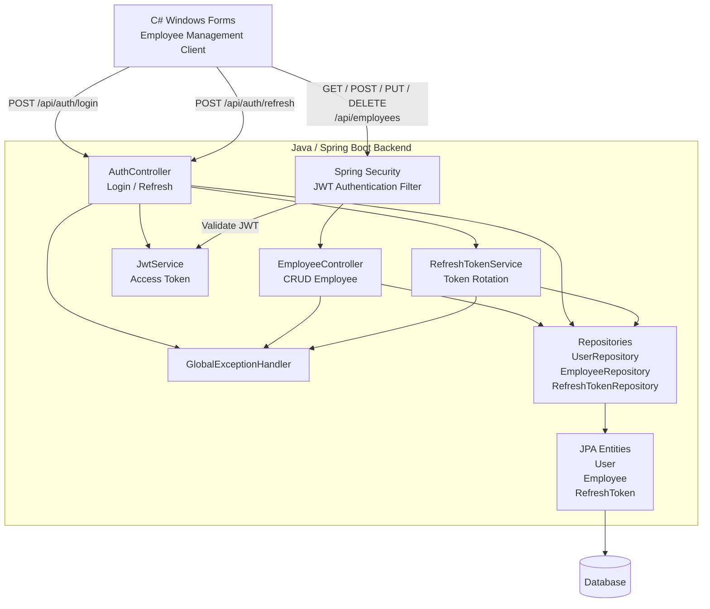
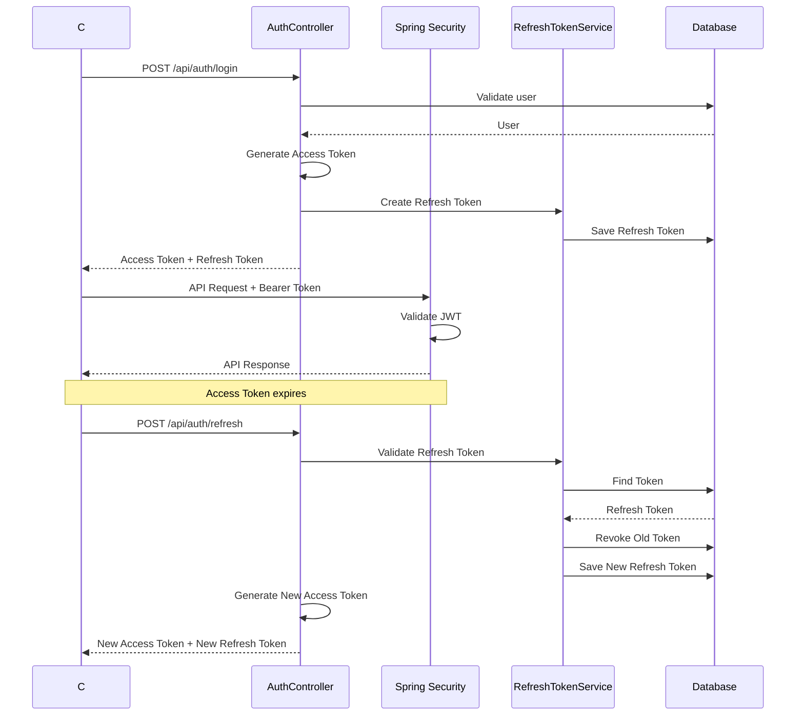

# Employee Management

A full-stack Employee Management application built to demonstrate **Java/Spring Boot development, REST API design, JWT authentication, refresh-token rotation, and a C# Windows Forms client**.

This project was created as a practical exercise to apply software engineering concepts in the Java/Spring Boot ecosystem.

---

## Architecture



---

## Authentication Flow

The application uses short-lived JWT access tokens together with refresh tokens.



---

## Refresh Token Rotation

Refresh tokens are rotated whenever they are successfully used.

```text
Refresh Token A
       │
       ▼
POST /api/auth/refresh
       │
       ├── Validate
       ├── Check expiration
       ├── Check revoked status
       │
       ▼
    Revoke A
       │
       ▼
 Generate Token B
       │
       ├── New Access Token
       └── New Refresh Token
```

The old refresh token cannot be reused:

```text
Refresh Token A
       │
       ▼
   Already revoked
       │
       ▼
401 Unauthorized
```

Example response:

```json
{
  "error": "invalid_refresh_token",
  "message": "Refresh token has been revoked"
}
```

Expired refresh tokens are also rejected:

```json
{
  "error": "invalid_refresh_token",
  "message": "Refresh token has expired"
}
```

---

## Features

### Authentication

* Login using username and password
* JWT-based authentication
* Short-lived access token
* Refresh token
* Refresh token expiration
* Refresh token rotation
* Refresh token revocation
* Protection against reuse of revoked refresh tokens
* Authentication error handling
* HTTP `401 Unauthorized` for invalid refresh tokens

### Employee Management

* Create employee
* Get employees
* Update employee
* Delete employee
* RESTful API endpoints
* Swagger/OpenAPI documentation

### Client Application

* C# Windows Forms client
* Login form
* Employee management form
* API communication through `ApiClient`
* Bearer token authentication
* Refresh-token support

---

## Technology Stack

### Backend

* Java
* Spring Boot
* Spring Security
* Spring Data JPA
* JWT
* Maven
* Swagger / OpenAPI

### Frontend / Client

* C#
* .NET
* Windows Forms
* `HttpClient`

### Database

* Relational database
* JPA / Hibernate

---

## Project Structure

```text
employee-management/
│
├── backend/
│   └── employee-api/
│       │
│       ├── src/
│       │   └── main/
│       │       ├── java/
│       │       │   └── employee_api/
│       │       │       │
│       │       │       ├── controller/
│       │       │       │   ├── AuthController.java
│       │       │       │   └── EmployeeController.java
│       │       │       │
│       │       │       ├── dto/
│       │       │       │   ├── AuthResponse.java
│       │       │       │   ├── ErrorResponse.java
│       │       │       │   └── RefreshTokenRequest.java
│       │       │       │
│       │       │       ├── entity/
│       │       │       │   ├── User.java
│       │       │       │   ├── Employee.java
│       │       │       │   └── RefreshToken.java
│       │       │       │
│       │       │       ├── repository/
│       │       │       │   ├── UserRepository.java
│       │       │       │   ├── EmployeeRepository.java
│       │       │       │   └── RefreshTokenRepository.java
│       │       │       │
│       │       │       ├── security/
│       │       │       │   ├── JwtService.java
│       │       │       │   ├── JwtAuthenticationFilter.java
│       │       │       │   └── RefreshTokenService.java
│       │       │       │
│       │       │       └── exception/
│       │       │           ├── InvalidRefreshTokenException.java
│       │       │           └── GlobalExceptionHandler.java
│       │       │
│       │       └── resources/
│       │
│       └── pom.xml
│
└── frontend/
    └── EmployeeManagement/
        ├── Forms/
        │   ├── Form1.cs
        │   └── Form2.cs
        │
        ├── Models/
        │   ├── Employee.cs
        │   └── TokenResponse.cs
        │
        └── Services/
            └── ApiClient.cs
```

---

## API Endpoints

### Authentication

| Method | Endpoint            | Description                        |
| ------ | ------------------- | ---------------------------------- |
| `POST` | `/api/auth/login`   | Authenticate user                  |
| `POST` | `/api/auth/refresh` | Generate new access/refresh tokens |

### Employees

| Method   | Endpoint              | Description        |
| -------- | --------------------- | ------------------ |
| `GET`    | `/api/employees`      | Get all employees  |
| `GET`    | `/api/employees/{id}` | Get employee by ID |
| `POST`   | `/api/employees`      | Create employee    |
| `PUT`    | `/api/employees/{id}` | Update employee    |
| `DELETE` | `/api/employees/{id}` | Delete employee    |

Protected employee endpoints require:

```http
Authorization: Bearer <access-token>
```

---

## Login Response

A successful login returns:

```json
{
  "accessToken": "eyJ...",
  "refreshToken": "...",
  "tokenType": "Bearer",
  "expiresIn": 900
}
```

`expiresIn` is expressed in seconds.

For the default configuration:

```text
Access Token  = 15 minutes
Refresh Token = 7 days
```

---

## Refresh Token Request

```http
POST /api/auth/refresh
Content-Type: application/json
```

Request:

```json
{
  "refreshToken": "..."
}
```

Successful response:

```json
{
  "accessToken": "eyJ...",
  "refreshToken": "...",
  "tokenType": "Bearer",
  "expiresIn": 900
}
```

The refresh token returned by this endpoint replaces the previous refresh token.

---

## Error Handling

Invalid refresh tokens return:

```http
401 Unauthorized
```

Example:

```json
{
  "error": "invalid_refresh_token",
  "message": "Refresh token has been revoked"
}
```

Expired refresh token:

```json
{
  "error": "invalid_refresh_token",
  "message": "Refresh token has expired"
}
```

---

## Swagger

After starting the Spring Boot application, Swagger UI is available at:

```text
http://localhost:8080/swagger-ui/index.html
```

Swagger can be used to test:

* Authentication
* JWT protected endpoints
* Employee CRUD
* Refresh token flow

---

## Running the Backend

Navigate to:

```bash
cd backend/employee-api
```

Build the application:

```bash
mvn clean compile
```

Run:

```bash
mvn spring-boot:run
```

The API will normally be available at:

```text
http://localhost:8080
```

---

## Running the Client

Open the Windows Forms project in Visual Studio.

Configure the API base URL:

```csharp
new ApiClient("http://localhost:8080");
```

Build and run the application.

---

## Security Design

The authentication design intentionally separates the lifetime of the two tokens.

### Access Token

The access token is short-lived and is used to access protected APIs.

```text
Lifetime: 15 minutes
```

### Refresh Token

The refresh token has a longer lifetime and is only used to obtain a new access token.

```text
Lifetime: 7 days
```

### Rotation

Every successful refresh invalidates the previous refresh token.

This reduces the usefulness of a previously captured refresh token.

---

## Development Notes

This project is primarily a practical learning and portfolio project for applying existing software engineering experience to the Java/Spring Boot ecosystem.

The implementation focuses on:

* REST API development
* Authentication and authorization
* JWT
* Token lifecycle management
* CRUD operations
* Repository pattern through Spring Data JPA
* Exception handling
* API documentation
* Client-server communication

---

## What I Learned

Building this project provided practical experience with:

* Spring Boot application structure
* Dependency injection
* Spring Security
* JWT authentication
* Refresh-token lifecycle
* Refresh-token rotation
* REST API design
* Spring Data JPA
* Maven project management
* Swagger/OpenAPI
* C# `HttpClient` integration with a Java backend

---

## Author

**Ma'ruf Hidayat**

Software Engineer | .NET | Java/Spring Boot | AI-powered Software Development

GitHub:

https://github.com/hagemaruf

LinkedIn:

https://linkedin.com/in/hagemaruf/

```
